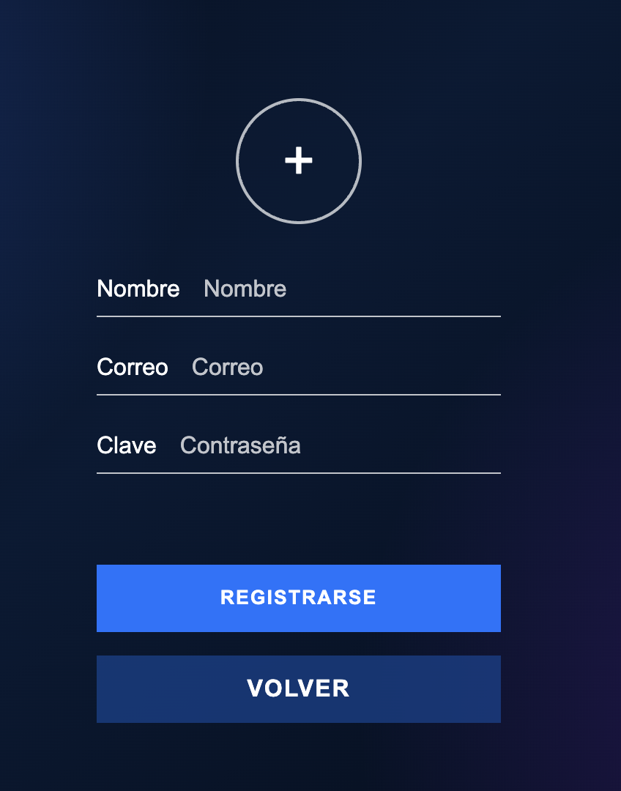
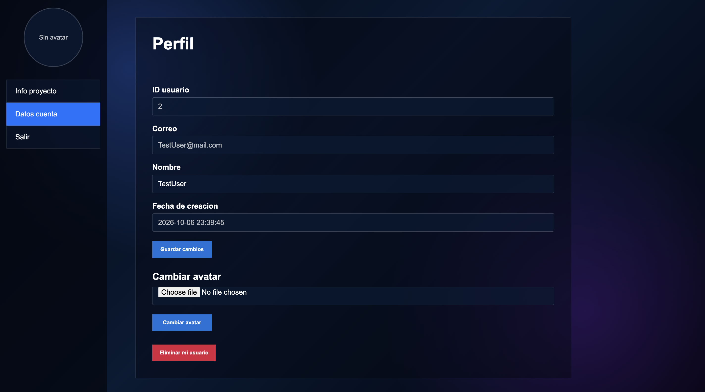
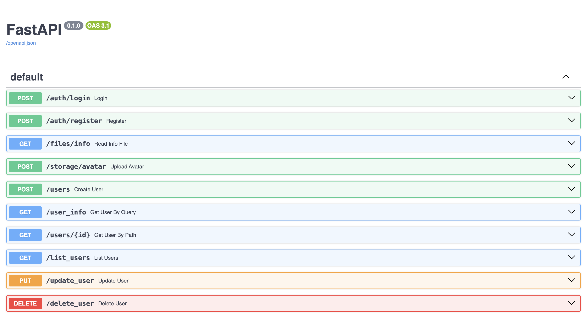

# API REST de gestión de usuarios

Proyecto final de Programación desarrollado durante el primer curso de Desarrollo de Aplicaciones Web (DAW).

La aplicación combina un frontend en HTML, CSS y JavaScript con una API REST creada con FastAPI. Incluye autenticación mediante Supabase, persistencia local con SQLite y gestión de avatares con Supabase Storage.

## Funcionalidades

- Registro e inicio de sesión con Supabase Auth.
- Validación de sesiones mediante tokens Bearer.
- Operaciones CRUD sobre perfiles almacenados en SQLite.
- Persistencia de datos con SQLite.
- Implementaciones de acceso a datos con `sqlite3` y SQLAlchemy.
- Subida de avatares a Supabase Storage mediante su interfaz compatible con S3.
- Lectura de información desde un archivo del servidor.
- Interfaz web para gestionar el perfil del usuario.

## Capturas

### Acceso y registro

<p align="center">
  
  
</p>

### Perfil de usuario



### Documentación de la API



## Tecnologías

- Python 3.10+
- FastAPI y Uvicorn
- SQLite y SQLAlchemy
- Supabase Auth y Supabase Storage
- Boto3
- HTML5, CSS3 y JavaScript

## Arquitectura

El backend está organizado en capas para separar responsabilidades:

- `controllers`: endpoints y gestión de las peticiones HTTP.
- `services`: reglas y lógica de la aplicación.
- `adapters`: acceso a SQLite, SQLAlchemy y Supabase Storage.
- `models`: modelos de entrada, respuesta y dominio.

Gracias a la interfaz `UserAdapter`, la capa de servicio puede utilizar tanto la implementación directa con `sqlite3` como la implementación con SQLAlchemy. Para cambiar entre ambas basta con sustituir el adaptador configurado en `UserServiceImpl`, sin modificar los controladores ni la lógica de negocio.

```text
.
├── backend
│   ├── adapters
│   │   ├── implementations
│   │   │   ├── supabase_s3_adapter.py
│   │   │   ├── user_no_orm_adapter.py
│   │   │   └── user_orm_adapter.py
│   │   └── interfaces
│   │       ├── storage_adapter.py
│   │       └── user_adapter.py
│   ├── controllers
│   │   ├── auth_controller.py
│   │   ├── file_controller.py
│   │   ├── storage_controller.py
│   │   └── user_controller.py
│   ├── services
│   │   ├── implementations
│   │   │   ├── auth_service_impl.py
│   │   │   ├── storage_service_impl.py
│   │   │   └── user_service_impl.py
│   │   └── interfaces
│   │       ├── auth_service.py
│   │       ├── storage_service.py
│   │       └── user_service.py
│   ├── models
│   ├── data
│   ├── database
│   ├── app.py
│   └── main.py
├── frontend
│   ├── app.js
│   ├── index.html
│   ├── login.html
│   ├── style.css
│   └── users.html
├── tests
│   ├── conftest.py
│   ├── test_auth_service.py
│   ├── test_storage_adapter.py
│   ├── test_user_controller.py
│   ├── test_user_no_orm_adapter.py
│   └── test_user_service.py
├── docs
│   └── images
├── .env.example
├── .gitignore
├── README.md
├── requirements-dev.txt
└── requirements.txt
```

## Puesta en marcha

### 1. Crear y activar un entorno virtual

```bash
python -m venv .venv
source .venv/bin/activate
```

En Windows:

```powershell
.venv\Scripts\activate
```

### 2. Instalar las dependencias

```bash
python -m pip install -r requirements.txt
```

### 3. Configurar Supabase

Copia `.env.example` como `.env` y completa las variables con los datos de tu propio proyecto de Supabase:

```bash
cp .env.example .env
```

```dotenv
SUPABASE_URL=
SUPABASE_ANON_KEY=
SUPABASE_S3_ENDPOINT=
SUPABASE_S3_REGION=
SUPABASE_S3_ACCESS_KEY=
SUPABASE_S3_SECRET_KEY=
SUPABASE_S3_BUCKET=
```

El proyecto espera autenticación por correo y contraseña, un bucket público para los avatares y una tabla pública `profiles` asociada a los usuarios de Supabase Auth.

> El archivo `.env` contiene credenciales y está excluido del repositorio.

### 4. Ejecutar el backend

```bash
cd backend
uvicorn main:app --reload
```

La API quedará disponible en `http://127.0.0.1:8000` y su documentación interactiva en `http://127.0.0.1:8000/docs`.

La base de datos `backend/database/database.db` se crea automáticamente al utilizar por primera vez un endpoint de usuarios.

### 5. Ejecutar el frontend

Desde la raíz del proyecto, en otra terminal:

```bash
python -m http.server 5500 --directory frontend
```

Abre `http://127.0.0.1:5500` en el navegador.

## Tests

Las pruebas del adaptador SQLite utilizan una base de datos temporal independiente y no modifican los datos de la aplicación.

Instala las dependencias de desarrollo y ejecuta la suite con:

```bash
python -m pip install -r requirements.txt -r requirements-dev.txt
pytest -q
```

La suite contiene 30 tests y comprueba:

- Creación de la tabla y operaciones CRUD con una SQLite temporal.
- Independencia entre registros y listado de usuarios.
- Validaciones de la capa de servicio.
- Autenticación y autorización, incluidos los códigos `401`, `403` y `404`.
- Login con Supabase Auth mediante una respuesta simulada.
- Subida de avatares mediante un cliente S3 simulado.

Las pruebas de Supabase y S3 no realizan peticiones a Internet ni necesitan credenciales reales.

Los casos de prueba fueron seleccionados por el autor según los comportamientos que consideró necesario validar. Su implementación se realizó con apoyo de herramientas de inteligencia artificial y los resultados fueron revisados antes de incorporarlos al proyecto.

## Endpoints principales

| Método | Endpoint | Descripción |
| --- | --- | --- |
| `POST` | `/auth/register` | Registra un usuario |
| `POST` | `/auth/login` | Inicia sesión y devuelve un token |
| `POST` | `/users` | Crea un usuario local |
| `GET` | `/users/{id}` | Consulta un usuario |
| `GET` | `/user_info?id={id}` | Consulta un usuario mediante query parameter |
| `GET` | `/list_users` | Lista los identificadores de usuario |
| `PUT` | `/update_user` | Actualiza el nombre del usuario autenticado |
| `DELETE` | `/delete_user?id={id}` | Elimina el perfil público de Supabase y el registro local del usuario autenticado |
| `POST` | `/storage/avatar` | Sube y actualiza el avatar |
| `GET` | `/files/info` | Lee la información del proyecto |

## Seguridad

- Las contraseñas se gestionan mediante Supabase Auth y no se almacenan en SQLite.
- Las credenciales se cargan desde variables de entorno.
- Las operaciones de modificación y eliminación comprueban que el token pertenezca al propietario del usuario.
- El correo se considera parte de la identidad gestionada por Supabase Auth y no se modifica desde el perfil local.
- El archivo `.env`, las bases de datos locales y los archivos temporales están excluidos mediante `.gitignore`.
- El repositorio no contiene usuarios, correos ni credenciales reales.

## Proceso de desarrollo

El backend, la arquitectura de la aplicación y la integración con SQLite y Supabase fueron desarrollados por el autor.

Para implementar parte de la interfaz y del código JavaScript se utilizaron herramientas de inteligencia artificial como apoyo, siguiendo los requisitos y el funcionamiento definidos por el autor. El resultado fue posteriormente revisado e integrado con el backend.

## Autor

Brooklyn Muñoz Acevedo
